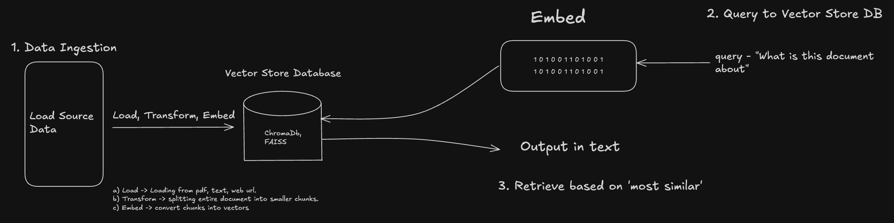

# Retrieval Augmented Generation (RAG) System

This directory contains code for implementing a Retrieval Augmented Generation (RAG) system using LangChain and Ollama.

## Overview

RAG combines retrieval-based and generation-based approaches:

1. **Retrieval**: Find relevant documents from a knowledge base
2. **Augmentation**: Use retrieved documents as context
3. **Generation**: Generate answers based on the retrieved context

## RAG Pipeline FLow


## Components

### 1. Web Content Loading - URLS

```python
loader = WebBaseLoader(web_path=("https://python.langchain.com/docs/tutorials/rag/",),
                       bs_kwargs=dict(parse_only=bs4.SoupStrainer(class_=("theme-doc-markdown markdown", "main-wrapper mainWrapper_z2l0")))
                       )
```

- `WebBaseLoader`: Fetches content from web URLs
- `bs_kwargs`: BeautifulSoup keyword arguments for HTML parsing
- `SoupStrainer`: Filters HTML to only extract content with specific CSS classes
- This approach extracts only the main content, ignoring navigation, footers, etc.

### 2. Document Splitting - PDF or Text files

```python
text_splitter = RecursiveCharacterTextSplitter(chunk_size=1000, chunk_overlap=200)
chunks = text_splitter.split_documents(docs)
```

- Splits large documents into smaller chunks of 1000 characters
- Creates a 200-character overlap between consecutive chunks
- Overlap maintains context across chunk boundaries
- Visualization of overlap:
  ```
  Chunk 1: [........1000 characters........]
                                    [--200--]
  Chunk 2:                          [--200--][....800 new characters....]
  ```

### 3. Vector Embeddings using Ollama model

```python
embeddings = OllamaEmbeddings(model="nomic-embed-text")
```

- Converts text chunks into vector representations
- Uses Ollama's embedding models (like nomic-embed-text)
- Vectors capture semantic meaning in high-dimensional space
- Important: Always specify the model you want to use

### 4. Vector Database - Chroma or FAISS vector DB

```python
db = Chroma.from_documents(chunks[:10], embeddings)
```

- Stores vector embeddings for efficient retrieval
- `Chroma`: Vector database built for RAG applications
- Associates document metadata and content with vectors
- Optimized for fast similarity search

### 5. Similarity Search

```python
query = "How many pages are there in the document?"
results = db.similarity_search(query)
results[0].page_content
```

How similarity search works:

1. Query is converted to a vector using the same embedding model
2. Cosine similarity is calculated between query vector and all document vectors
3. Documents are ranked by similarity score
4. Most similar documents are returned, with the most relevant first
