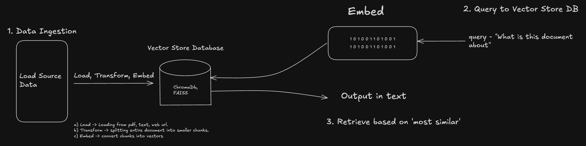
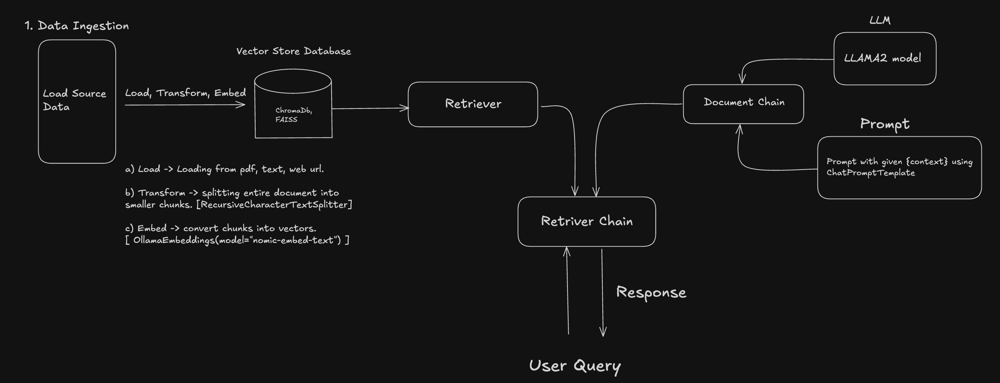

# Retrieval Augmented Generation - Pipeline (RAG) System

This directory contains code for implementing a Retrieval Augmented Generation (RAG) system using LangChain and Ollama.

## Overview

RAG combines retrieval-based and generation-based approaches:

1. **Retrieval**: Find relevant documents from a knowledge base
2. **Augmentation**: Use retrieved documents as context
3. **Generation**: Generate answers based on the retrieved context

## RAG Pipeline FLow



## Components

### 1. Web Content Loading - URLS

```python
loader = WebBaseLoader(web_path=("https://python.langchain.com/docs/tutorials/rag/",),
                       bs_kwargs=dict(parse_only=bs4.SoupStrainer(class_=("theme-doc-markdown markdown", "main-wrapper mainWrapper_z2l0")))
                       )
```

- `WebBaseLoader`: Fetches content from web URLs
- `bs_kwargs`: BeautifulSoup keyword arguments for HTML parsing
- `SoupStrainer`: Filters HTML to only extract content with specific CSS classes
- This approach extracts only the main content, ignoring navigation, footers, etc.

### 2. Document Splitting - PDF or Text files

```python
text_splitter = RecursiveCharacterTextSplitter(chunk_size=1000, chunk_overlap=200)
chunks = text_splitter.split_documents(docs)
```

- Splits large documents into smaller chunks of 1000 characters
- Creates a 200-character overlap between consecutive chunks
- Overlap maintains context across chunk boundaries
- Visualization of overlap:
  ```
  Chunk 1: [........1000 characters........]
                                    [--200--]
  Chunk 2:                          [--200--][....800 new characters....]
  ```

### 3. Vector Embeddings using Ollama model

```python
embeddings = OllamaEmbeddings(model="nomic-embed-text")
```

- Converts text chunks into vector representations
- Uses Ollama's embedding models (like nomic-embed-text)
- Vectors capture semantic meaning in high-dimensional space
- Important: Always specify the model you want to use

### 4. Vector Database - Chroma or FAISS vector DB

```python
db = Chroma.from_documents(chunks[:10], embeddings)
```

- Stores vector embeddings for efficient retrieval
- `Chroma`: Vector database built for RAG applications
- Associates document metadata and content with vectors
- Optimized for fast similarity search

### 5. Similarity Search

```python
query = "How many pages are there in the document?"
results = db.similarity_search(query)
results[0].page_content
```

How similarity search works:

1. Query is converted to a vector using the same embedding model
2. Cosine similarity is calculated between query vector and all document vectors
3. Documents are ranked by similarity score
4. Most similar documents are returned, with the most relevant first

# Advanced RAG Pipeline

The advanced RAG pipeline connects multiple components into a cohesive chain using LangChain's expression language:



#### A. Language Model Setup

```python
from langchain_community.llms import Ollama
llm = Ollama(model="llama2")
```

- Initializes the language model that will generate the final response
- Uses Ollama to run the model locally

#### B. Prompt Template

```python
prompt = ChatPromptTemplate.from_template("""
                                         Answer the question based on the context provided.
                                         Think step by step before answering.
                                         Context: {context}
                                         Question: {input}
                                         """)
```

- Defines the structure for prompting the LLM
- Contains placeholders for:
  - `{context}`: Where retrieved documents will be inserted
  - `{input}`: Where the user's query will be inserted

#### C. Document Chain

```python
document_chain = create_stuff_documents_chain(llm, prompt)
```

- Creates a chain that:
  1. Takes retrieved documents from the vector database
  2. Combines them into a single context string
  3. Inserts this context into the prompt template's `{context}` placeholder
  4. Adds the user query to the `{input}` placeholder
  5. Sends the complete prompt to the LLM

#### D. Retriever

```python
retriever = db.as_retriever()
```

- Converts the vector database into a retriever object
- When given a query, it:
  1. Converts the query to a vector embedding
  2. Retrieves the most semantically similar documents
  3. Returns these documents to be used as context

#### E. Retrieval Chain

```python
retrieval_chain = create_retrieval_chain(retriever, document_chain)
```

- Connects the retriever and document chain into a complete pipeline
- Manages the entire workflow from query to response:
  1. Takes a user query
  2. Passes it to the retriever to get relevant documents
  3. Sends those documents and the query to the document chain
  4. Returns the LLM's response

#### F. Using the Complete Chain

```python
response = retrieval_chain.invoke({"input": "What is this document about?"})
response['answer']
```

- Executes the entire RAG pipeline in a single call
- Returns the final answer generated by the LLM based on the retrieved context

This advanced pipeline architecture provides a modular, maintainable approach to building RAG applications, with clear separation of concerns between retrieval, context creation, and response generation.
