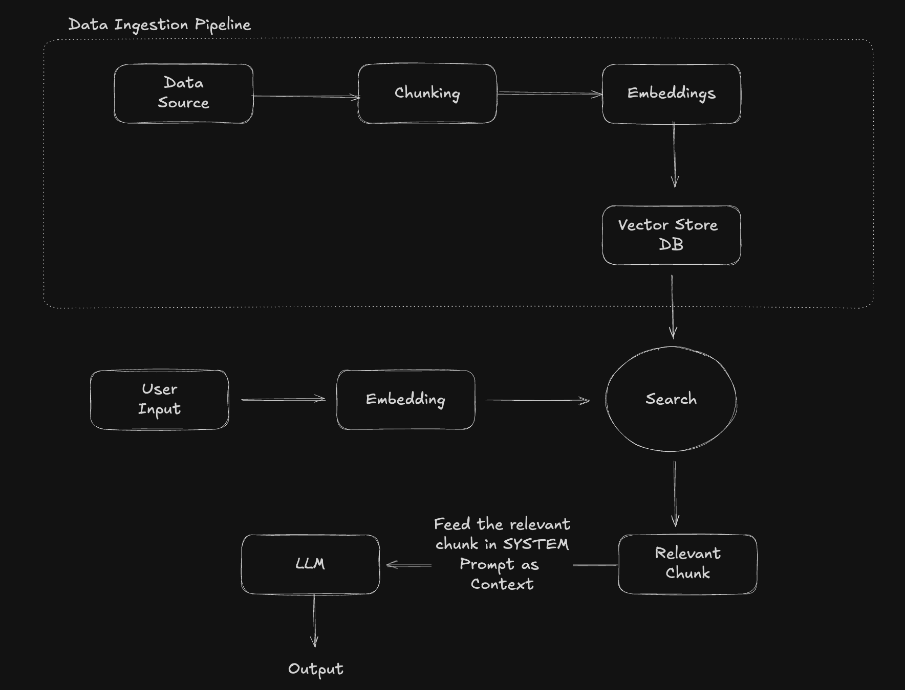
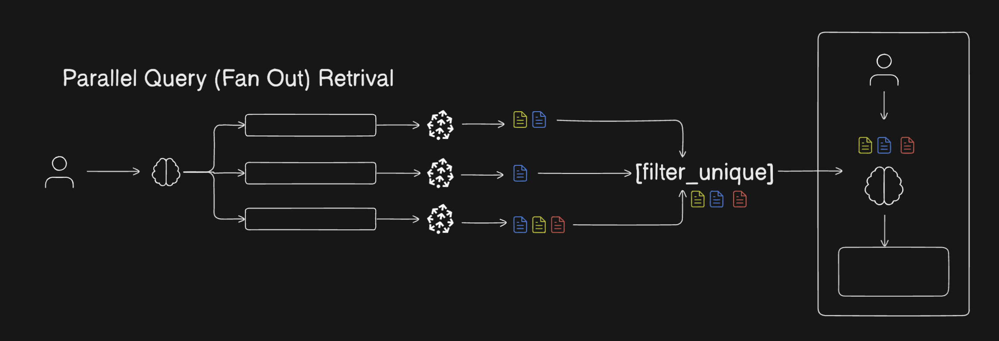
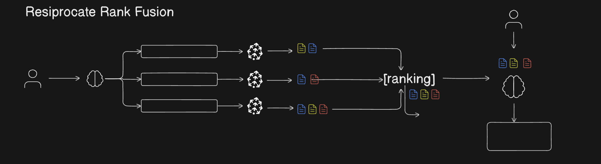
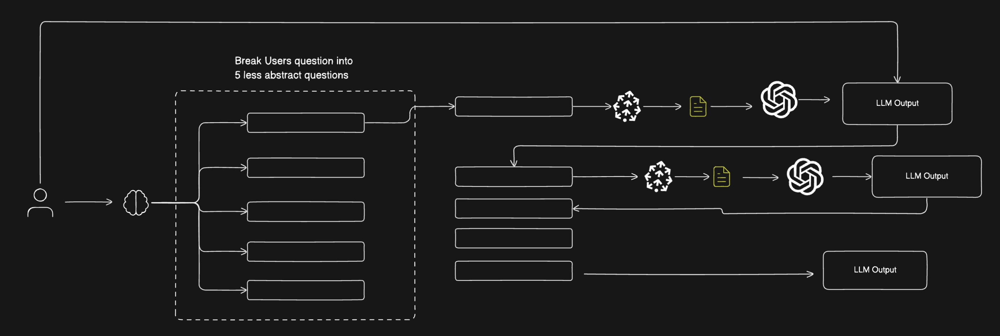
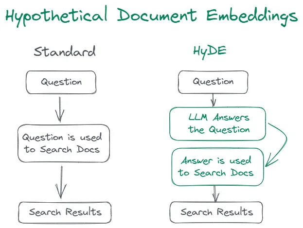

# RAG from Scratch

## Overview

RAG combines the power of retrieval systems with generative AI to produce factual, context-aware responses. The system:

1. Ingests documents (PDFs in this case)
2. Breaks them into manageable chunks
3. Creates embeddings (vector representations) of these chunks
4. Stores them in a vector database
5. Retrieves relevant information when queried
6. Uses an LLM to generate answers based on retrieved context

## Architecture

The pipeline consists of two main parts:

### Data Ingestion Pipeline

- **Data Source**: PDF documents loaded using PyPDFLoader
- **Chunking**: Documents split into smaller sections using RecursiveCharacterTextSplitter
- **Embeddings**: Text chunks converted to vector embeddings using OpenAI's embedding model
- **Vector Store DB**: Embeddings stored in Qdrant vector database

### Query Pipeline

- **User Input**: Question or query from the user
- **Embedding**: Query is converted to the same vector space as the documents
- **Search**: Vector similarity search finds relevant chunks in the database
- **Relevant Chunk**: The most similar content is retrieved
- **LLM**: The relevant chunks are fed to OpenAI's GPT model as context
- **Output**: Model generates a response based on the context and query

## Implementation

This implementation uses:

- LangChain components for document processing and vector operations
- OpenAI embeddings and GPT models for semantic understanding
- Qdrant [from docker] as the vector database for efficient similarity search

## Query Transformation Techniques

We've implemented several advanced query transformation techniques to improve the quality and relevance of responses:

### 1. Parallel Query Fan-out Retrieval

This technique:

- Uses LLM to generate multiple alternative queries from the original user query
- Executes these queries in parallel against the vector database
- Retrieves chunks for each query variation
- Filters and combines the results to remove duplicates
- Passes the combined unique chunks to the LLM for the final answer

This approach captures different semantic aspects of the original query, improving retrieval coverage.

### 2. Reciprocal Rank Fusion (RRF)

Instead of simply merging chunks, RRF:

- Ranks documents across multiple retrieval results using a scoring system
- Assigns scores based on the position of documents in each result list
- Uses the formula: score = 1/(rank + constant)
- Aggregates scores for documents appearing in multiple lists
- Sorts documents by their aggregated scores
- Provides the highest-ranked documents to the LLM

This method gives higher weight to documents that appear at the top of multiple result lists.

### 3. Query Decomposition

This technique breaks down complex queries into simpler sub-queries and processes them sequentially:

#### Less Abstract (Sequential Processing)

- Breaks the original query into multiple sub-queries
- Processes each sub-query in sequence
- Uses the answer from each step as context for the next sub-query
- Builds up knowledge progressively
- Combines all intermediate outputs for a comprehensive final answer

This creates a chain-of-thought process that helps with complex reasoning tasks.

### 4. HyDE (Hypothetical Document Embedding)

This innovative technique:

- Uses the LLM to generate a hypothetical "perfect document" that would answer the query
- Creates embeddings for this synthetic document
- Uses these embeddings to retrieve relevant real documents from the vector store
- Passes the retrieved real documents to the LLM to generate the final answer

HyDE is particularly effective for complex queries where direct retrieval might miss relevant information.

